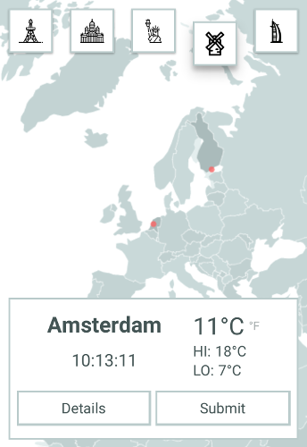

A simple one page mobile(portrait) first weather app. [Demo](https://weather-a52d4.herokuapp.com/).



### Tech stack

#### Vue
I chose to use vue because I didn't want a build system distracting me but later when complexity grew I decided to pick up webpack despite my slow laptop running it very slowly. I also really like how easy it is to animate things in vue.

#### d3 & topojson
I wanted to have a map to visualize the world but I found google maps integration is very slow and unreliable especially on pans and zooms. It took me a while to find a replacement but d3-geo combined with topojson and earth svg data looked really impressive and didn't have the full package baggage of google maps. It was not easy to learn how d3 works but it was worth the effort!

#### socket.io
To receive data real time I needed to use websockets so I chose to try out socket.io. It just works, like magic. I still decided to get the initial payload with a fetch so I actually have an api endpoint and can reliably work with errors.

#### nedb
A lovely tiny local database with the familiar mongodb api. Good for a quick prototype and easy to upgrade to the well scaling mongodb.

## UI & UX design choices
It was important that the ui is simple and not too crowded for mobiles. I wanted there to be three main actions; changing city, reading data and submitting data. Reading data is the most important but you don't want to be distracted by too many things so I chose to extend the details of measurements to a modal.  
Changing cities was an equally important thing. People are used to menus being in the top of their application so I wanted the 'switch' to be there. Since there is only 5 locations I chose to show them all in a row with some icons to catch the eye. However if this were to scale larger we would need to think some other solution for this. Perhaps to be able to scroll the map and click on locations together with a search box.  
Submitting data is the third action and it was a natural choice to put in a modal because not everyone wants to submit data. At first I had the form be a select and a number input, this was problematic for one reason especially. The number input on a mobile opens the keyboard that makes the space on screen very small. This could be worked around but I think it would take some time to get it right. I found using a range input was a more elegant solution. I dropped the select input for city completely and decided to have it be based on the location in the current view. This way the form became very simple and clean making it quick and easy to use.   

## Todo / excercise for the reader
Some things were purposefully not implemented to save time. Possible future improvements to the code could include the following:
-  Routing: have the url change by selected location and(or) state
-  State: handle state by vuex
-  Responsive css: screen size testing was only done on my phone and laptop screen. If it looks bad on your screen this might be the reason.
-  SEO: server side rendering and 'proper' html syntax
-  Backend: a proper api and schedule changes to location timezones
-  Testing: guilty as charged I skipped testing completely to progress faster
-  optimization: Some optimizations here and there especially with library sizes
-  ui: add some colors

## Build Setup

``` bash
# install dependencies
npm install

# run the backend server in the background or a different window
# Tip: use forever, pm2, nohup or something similar for production.
npm start
#or
node server.js

# serve with hot reload at localhost:8080
npm run dev

# build for production with minification
npm run build
```

